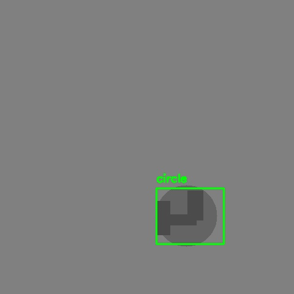

# Paligemma Fine-Tuning & Inference Pipeline


A complete pipeline for **fine-tuning Google's Paligemma vision-language model** on custom datasets and running **inference** for object detection tasks with **visualization and evaluation** tools.

---

## 📑 Table of Contents

* [Features](#-features)
* [Tech Stack](#-tech-stack)
* [Installation](#-installation)
* [Usage](#-usage)

  * [Fine-Tuning](#1-fine-tune-the-model)
  * [Inference & Visualization](#2-run-inference--visualization)
  * [Evaluation](#3-evaluate-results)
  * [Dataset Creation](#4-create-a-dataset)
* [Example Output](#-example-output)
* [Metrics](#-metrics)
* [Results](#-results)
* [License](#-license)
* [Acknowledgements](#-acknowledgements)

---

## 🚀 Features

* **Fine-tuning** on custom datasets with configurable hyperparameters
* **Inference** with bounding box predictions & label extraction
* **Visualization** of detections on test images
* **Evaluation** using mAP, IoU, Precision, Recall, and F1-score
* **Modular Codebase** with reusable utilities

---

## 🛠️ Tech Stack

* **Language**: Python 3.10+
* **Deep Learning**: PyTorch 2.0, Hugging Face Transformers
* **Model**: Paligemma-3B, Paligemma 2-3B
* **Data Handling**: OpenCV, NumPy
* **Evaluation**: COCO metrics.

---

## 📦 Installation

Clone the repository and install dependencies:

```bash
git clone https://github.com/Pradeep-Gopi-E/paligemma-finetune.git
cd paligemma-finetune
pip install -r requirements.txt
```

---

## ⚡ Usage

### 1. Fine-Tune the Model

```bash
python src/fine_tune/fine_tune.py --config configs/ft_config.py
```

* Configure **model** and **dataset** in `configs/ft_config.py`.
* Use `create_dataset.py` to prepare custom datasets.
* Hyperparameters can be adjusted in the config file.
* Fine-tuned models can be pushed to the Hugging Face Hub for later evaluation.

---

### 2. Run Inference & Visualization

```bash
python src/inference/visualize_detection.py --config configs/inference_config.py
```

* Configure model and dataset paths in `configs/inference_config.py`.
* Detections are saved under the `detections/` folder inside your image directory.
* Only YOLO-format local datasets are supported for now.

---

### 3. Evaluate Results

```bash
python src/inference/evaluate_results.py --config configs/inference_config.py
```

Configuration example inside `inference_config.py`:

```python
IMAGE_DIR = r"path/to/test/images"
LABEL_DIR = r"path/to/test/labels"
MODEL_ID = "your-username/fine_tuned_your_model"
IOU_THRESHOLD = 0.5
PROMPT = "detect circle ; triangle"
VISUALIZE = False
```

* Supports YOLO-format labels.
* Replace `MODEL_ID` with your fine-tuned model.

---

### 4. Create a Dataset

```bash
python src/data/create_dataset.py --config configs/dataset_config.py
```

* Configure dataset paths inside `dataset_config.py`.
* Supports only YOLO format.
* Dataset will be pushed to Hugging Face Hub, later can be used for training.

---

## 🖼 Example Output

* Annotated detection images with bounding boxes and class labels.
* Saved inside the `detections/` directory under the dataset path.

 <p align="center">
  
</p>

## 📊 Metrics

* **IoU (Intersection over Union)**
* **mAP (mean Average Precision)**
* **Precision, Recall, F1-score**

---

## 🏆 Results

* Results vary depending on dataset and hyperparameters.
* The below results is obtained on testing upon synthetic occluded objects dataset

### 🔹 Detailed Results

| Model Variant                    | Mean IoU | Precision | Recall | F1     | mAP\@0.5 | TP  | FP | FN |
| -------------------------------- | -------- | --------- | ------ | ------ | -------- | --- | -- | -- |
| **Fine-tuned Paligemma 3B 224**  | 0.8299   | 0.9633    | 0.9633 | 0.9633 | 0.8822   | 289 | 11 | 11 |
| **Pre-trained Paligemma 3B 224** | 0.7955   | 0.8738    | 0.9233 | 0.8979 | 0.7725   | 277 | 40 | 23 |

---

## 📜 License

This project is licensed under the [MIT License](LICENSE).

---

## 🙏 Acknowledgements

* [Google DeepMind - Paligemma](https://huggingface.co/google/paligemma-3b)
* [Hugging Face Transformers](https://huggingface.co/transformers/)
* [PyTorch](https://pytorch.org/)
* [Dataset] (https://drive.google.com/file/d/1-g0J70kxZpyRyWOdiChtJMPnYg5ag2gz/view?usp=drive_link)
